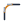

# Slate — CAD icon set

A 27-glyph icon set for CAD and drafting tools, published in **three interchangeable sets**:
`monotone`, `duotone` and `colour`. Every glyph is hand-authored SVG on a single 24×24 grid —
no auto-traced artwork, no raster fallbacks, no icon fonts.

Open **`index.html`** for the live spec sheet: switch sets, scrub the size, toggle the
construction grid, search, and click any icon to copy its SVG.

```
27 icons × 3 sets = 81 SVG files + 1 sprite
```

---

## The three sets

| Set | How it paints | Use it for |
| --- | --- | --- |
| **monotone** | Flat `currentColor`, uniform 1.5px weight, no fills | Toolbars, ribbons, dense UI at 16–20px |
| **duotone** | Subject at full tone, construction geometry at 38%, silhouette tinted at 16% | Toolbars that need depth without colour |
| **colour** | Graphite line work + a semantic accent hue per tool family | Empty states, onboarding, menus |

All three are generated from **one geometry definition per icon**, so switching sets never
reflows the artwork — only the paint changes.

### Colour families

| Family | Accent | Tint | Icons |
| --- | --- | --- | --- |
| Draw | `#2563eb` | `#dbeafe` | line, polyline, rectangle, circle, arc, ellipse, polygon, spline, hatch |
| Modify | `#d97706` | `#fef3c7` | trim, extend, fillet, chamfer, offset |
| Transform | `#0d9488` | `#ccfbf1` | mirror, array, move, rotate, dimension |
| Interface | `#475569` | `#e2e8f0` | select |

Line work is `#1e293b` (slate-800); construction geometry is `#94a3b8` (slate-400).

---

## Geometry

Rules kept mechanically consistent so icons sit well side by side.

- **Grid** — 24×24 viewBox, 18×18 live area, 3px optical padding. Terminals may bleed to
  1.5px from the edge so round caps optically align with the safe area.
- **Weight** — 1.5px stroke everywhere: primary, secondary, accent and node dots. No mixed weights.
- **Terminals** — round caps and joins throughout. Dashed construction lines switch to butt
  caps so the dash rhythm stays even.
- **Node dots** — 3px round caps on a zero-length sub-path, never scaled circles, so they
  inherit the stroke colour in every set.
- **Centring** — every glyph is optically centred; all 60 files are verified to sit inside
  the safe area within ±1.7px of centre.

### Roles

Each icon is built from four semantic roles. The variants are just different paint recipes
for the same roles:

| Role | Meaning | monotone | duotone | colour |
| --- | --- | --- | --- | --- |
| `primary` | the subject | 100% | 100% | `#1e293b` |
| `secondary` | guides, removed material | 100% | 38% | `#94a3b8` |
| `accent` | focal detail | 100% | 100% | family accent |
| `soft` | closed silhouette | — | 16% fill | family tint |

---

## The icons

| | | | |
| --- | --- | --- | --- |
| | | | |
| --- | --- | --- | --- |
| select | line | polyline | rectangle |
| circle | arc | ellipse | polygon |
| **spline** | **bezier** | **hermite** | **bspline** |
| **nurbs** | **conic** | **helix** | **spiral** |
| hatch | trim | extend | fillet |
| chamfer | offset | mirror | array |
| move | rotate | dimension | |

Bold rows are the **curve** family. Each one differs from its neighbours in exactly one
legible way:

| icon | reads as | the one thing that separates it |
| --- | --- | --- |
| spline | dots joined by a smooth curve | curve passes *through* every point |
| bezier | arch + two handle levers | curve meets its **ends**; handles sit off it |
| hermite | arch + a tangent arrow at each end | driven by tangent **vectors**, not points |
| bspline | curve floating inside its hull | curve does **not** touch the hull ends |
| nurbs | bspline + a leader on one vertex | a **weight** pulls the curve off the hull |
| conic | arc over a dashed chord | second-degree, single shoulder point |
| helix | coil | turns stacked in **depth** |
| spiral | flat concentric rings | one continuous turn, no depth |

`fillet` and `chamfer` are deliberately built as a matched pair: identical legs, identical
dashed "removed" sharp corner, and the corner detail zoomed to fill the frame. The only
difference is the connector — an arc versus a straight bevel — which is what separates
them at 16px.

---

## Files

```
index.html                 spec sheet + live preview (all 81 SVGs inlined)
icons/monotone/<name>.svg  27 files
icons/duotone/<name>.svg   27 files
icons/colour/<name>.svg    27 files
icons/slate-icons.svg      sprite — <symbol id="slate-<name>-<variant>">
icons/manifest.json        metadata for tooling and docs
scripts/build_icons.py     the generator (stdlib only)
```

### Inline

```html
<svg width="24" height="24" viewBox="0 0 24 24" fill="none" stroke="currentColor"
     stroke-width="1.5" stroke-linecap="round" stroke-linejoin="round">
  <use href="icons/slate-icons.svg#slate-line-duotone"/>
</svg>
```

### External

```html

```

`monotone` and `duotone` inherit `currentColor`, so they colour themselves from the
surrounding CSS — no per-colour exports needed.

---

## Regenerating

Geometry lives in one place. Edit it, then rebuild:

```bash
python3 scripts/build_icons.py
```

Python 3 standard library only — no dependencies. The script rewrites every SVG, the sprite,
`manifest.json` and `index.html`.

To add an icon, append one `icon(...)` call in `scripts/build_icons.py`; tag each sub-path
with a role (`primary`, `secondary`, `accent`, `soft`) and all three sets are produced for free.
